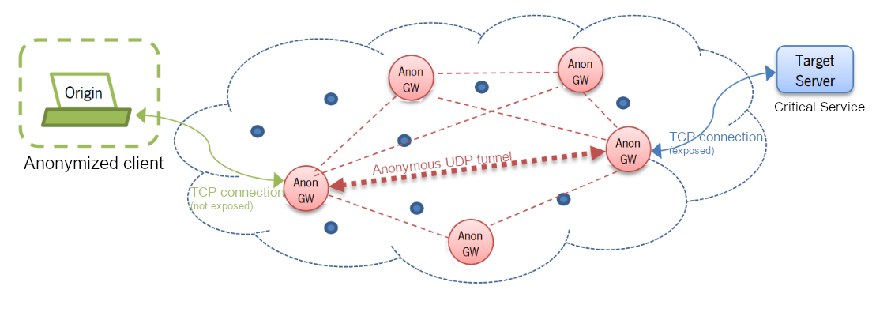
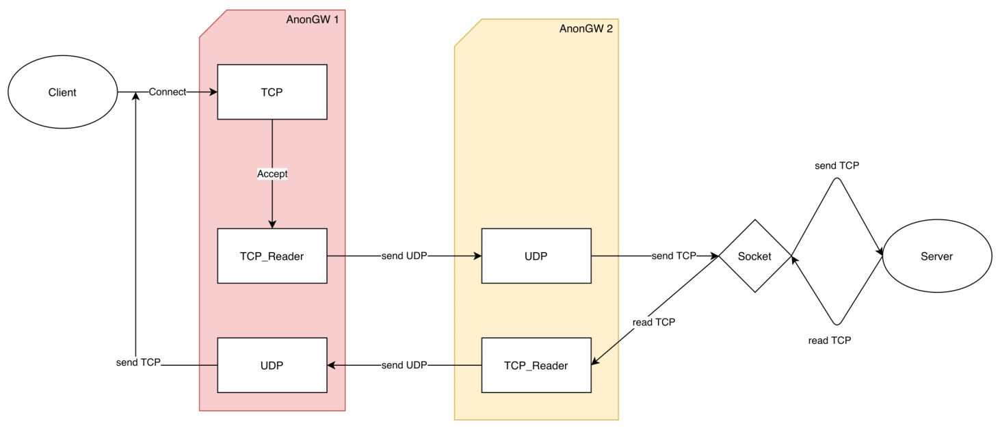

# Anon-Network
Threats to privacy are often taken lightly. Perhaps because privacy can always be seen through two prisms. As a right of every citizen not to be expiated in all their online activities as a user of services, whatever they may be, or just as a threat to the security of communities, which allows to hide illegal and criminal actions that affect the security of all. Privacy per se does not exist, as any activity on the network can potentially be audited by the servers connection logs (“logs”). One way to try to protect privacy is to disguise the true origin of connections. This approach is illustrated in the figure below, although with some nuances of its own.

All data sent by the Origin client over the TCP connection (not exposed) is received by the first AnonGW and immediately sent by the anonymous UDP tunnel to a second AnonGW, which in turn sends them over a new TCP connection (exposed) to the TargetServer. The reverse path is used in the same way in server responses. All data sent by TargetServer is received by the destination AnonGW through the TCP connection (exposed), and sent back through the anonymous UDP tunnel to the originating AnonGW, which finally sends it to the Origin client through the protected (unexposed) TCP connection. Privacy is guaranteed if and only if all AnonGW servers in the Overlay network forget the data of all connections made or received, not keeping any record in a file.

## Architeture of Threads

## Executing

To execute an AnonGW node, you use the following template:

`java AnonGW target-server <ip> port <port number> overlay-peers <ips>`

- The `<ip>` is the **IP** address of the target server.
- The `<port>` is a number that represents the port of the destination (target server).
- And the `<ips>` are the **IP** addresses of the connected **AnonGW** nodes.

For example we have 3 **AnonGW** nodes with **IP** addresses `10.3.3.1`, `10.3.3.2`, `10.3.3.3`, and want to start the machine with **IP** `10.3.3.1`. We also want to all the data that comes to this node, may be redirected to a server, with **IP** `10.0.0.1` running a **HTTP** server on port 80. So we execute the following line:

`java AnonGW target-server 10.0.0.1 port 80 overlay-peers 10.3.3.2 10.3.3.3`

## Developers

[Luís Macedo](https://github.com/FallenFoil/)   
[Angelo Sousa](https://github.com/AngeloACSousa)